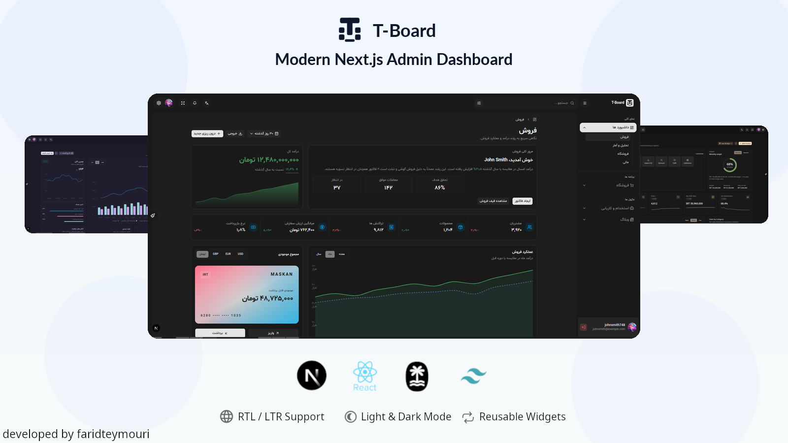
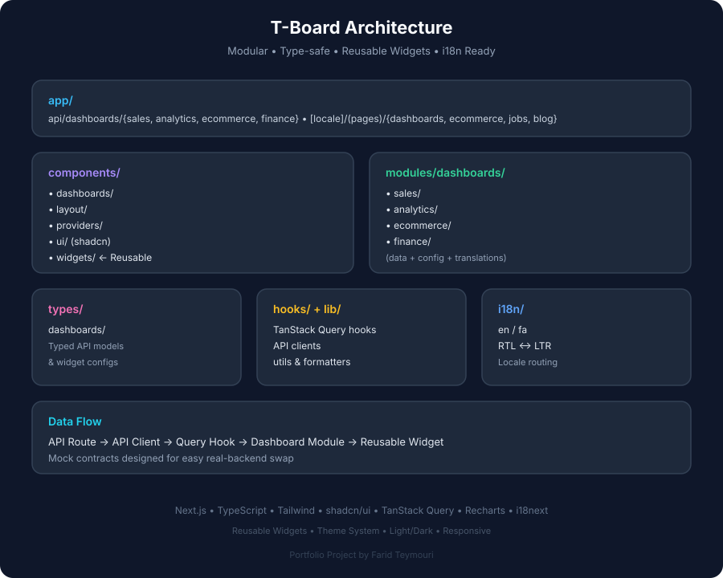

<p align="center">
  
</p>

<p align="center">
  <strong>Modern • Responsive • Multilingual Admin Dashboard</strong>
</p>

<p align="center">
  <a href="#live-demo">Live Demo</a> •
  <a href="#features">Features</a> •
  <a href="#dashboards">Dashboards</a> •
  <a href="#running-locally">Running Locally</a>
</p>

---

# T-Board

**T-Board** is a modern, responsive, and multilingual admin dashboard platform built with **Next.js, TypeScript, Tailwind CSS, shadcn/ui, TanStack Query, and Recharts**.
The project focuses on building a scalable dashboard architecture with reusable data-driven widgets, mock API contracts, responsive layouts, localization, RTL/LTR support, theme customization, and client-side preferences.

T-Board is developed as a **portfolio and engineering project**, with an emphasis on reusable architecture, separation of concerns, type safety, and maintainable frontend development.

---

## Live Demo

**Coming soon**

---

## Features

- Modern responsive admin dashboard UI
- Multiple dashboard experiences
- Reusable and configurable dashboard widgets
- Data-driven UI powered by mock API contracts
- Next.js App Router architecture
- TypeScript throughout the project
- TanStack Query for client-side data fetching and caching
- Recharts-powered data visualization
- Tailwind CSS
- shadcn/ui components
- English and Persian localization
- Full RTL/LTR support
- Light and dark modes
- Custom theme presets
- Responsive dashboard layouts
- Loading and skeleton states
- Typed API response models
- Modular feature-based architecture
- Reusable formatting utilities for numbers, currencies, and durations
- Client-side UI preferences

---

## Dashboards

T-Board currently includes four dashboard experiences.

### Sales Dashboard

A sales-focused dashboard for monitoring business performance, revenue, customers, traffic sources, products, and recent activity.

Includes:

- Sales summary
- Sales metrics
- Revenue
- Sales performance
- Top-selling products
- Total balance
- Traffic sources
- Visitor devices
- Recent transactions

---

### Analytics Dashboard

An analytics-focused dashboard for understanding traffic, acquisition, visitor behavior, conversions, and real-time activity.

Includes:

- Overview metrics
- Acquisition analytics
- Traffic channels
- Visitor devices
- Top pages
- Referrers and events
- Real-time activity
- Conversion funnel

---

### Ecommerce Dashboard

An ecommerce-focused dashboard for monitoring revenue, orders, products, inventory, sales channels, and customer insights.

Includes:

- Monthly target
- KPI cards
- Revenue and orders
- Sales by category
- Sales by channel
- Inventory status
- Top products
- Recent orders
- Customer insights
- Quick actions

---

### Finance Dashboard

A personal/business finance dashboard focused on balances, cash flow, budgets, spending, accounts, and transactions.

Includes:

- Finance summary
- KPI cards
- Cash flow
- Total balance
- Accounts
- Budget utilization
- Spending by category
- Recent transactions

---

## Widget Architecture

One of the main goals of T-Board is to avoid building every dashboard widget as a completely independent UI implementation.

Instead, dashboards are composed from reusable generic widgets.

Current widget primitives include:

- `SummaryWidget`
- `KpiCardsWidget`
- `MetricWidget`
- `MetricGroup`
- `MetricListWidget`
- `ProgressListWidget`
- `BreakdownWidget`
- `TableWidget`
- `TargetWidget`
- `QuickActionsWidget`
- `FeaturedMetricWidget`
- `ComposedChartWidget`
- `ComparisonChartWidget`
- `LiveLineChartWidget`
- `SegmentedProgressWidget`

Dashboard-specific modules provide the data, configuration, translations, and API integration while the reusable widget layer handles presentation.

This makes it possible to reuse the same UI architecture across different dashboard domains without coupling components to a specific business use case.

---

## Architecture

The project follows a modular architecture that separates application routing, reusable UI, dashboard modules, API contracts, and shared types.

<p align="center">
  
</p>

```text
app/
├── api/
│   └── dashboards/
│       ├── analytics/
│       ├── ecommerce/
│       ├── finance/
│       └── sales/
│
├── [locale]/
│   └── (pages)/
│       ├── dashboards/
│       ├── ecommerce/
│       ├── jobs/
│       └── blog/
│
components/
├── dashboards/
├── layout/
├── providers/
├── ui/
└── widgets/

modules/
└── dashboards/
    ├── analytics/
    ├── ecommerce/
    ├── finance/
    └── sales/

types/
└── dashboards/
    ├── analytics/
    ├── ecommerce/
    ├── finance/
    └── sales/

hooks/
lib/
i18n/
utils/
```

### Application Routes

Next.js App Router is used for the application structure and localized routes.

```text
/[locale]/dashboards/sales
/[locale]/dashboards/analytics
/[locale]/dashboards/ecommerce
/[locale]/dashboards/finance

/[locale]/ecommerce/products
/[locale]/ecommerce/product-details
/[locale]/ecommerce/invoices
/[locale]/ecommerce/checkout

/[locale]/jobs/list
/[locale]/jobs/job-details
/[locale]/jobs/dashboards

/[locale]/blog/list
/[locale]/blog/blog-details
```

The dashboard experiences are currently the primary implemented part of the project. The remaining application sections are being developed incrementally.

---

## Mock API Architecture

The dashboard data layer is designed around backend-like API contracts.

For example:

```text
/api/dashboards/finance/kpi-cards
/api/dashboards/finance/cash-flow
/api/dashboards/finance/accounts
/api/dashboards/finance/recent-transactions

/api/dashboards/ecommerce/kpi-cards
/api/dashboards/ecommerce/revenue-orders
/api/dashboards/ecommerce/recent-orders

/api/dashboards/analytics/traffic-channels
/api/dashboards/analytics/conversion-funnel

/api/dashboards/sales/sales-summary
/api/dashboards/sales/sales-performance
```

These endpoints currently provide mock data but intentionally follow a backend-oriented contract structure.

This allows the dashboard modules to consume data through the same patterns that can later be connected to a real backend.

---

## Data Fetching

Dashboard data is fetched using **TanStack Query**.

The architecture separates:

```text
API Route
   ↓
API Client
   ↓
Query Hook
   ↓
Dashboard Widget
```

For example:

```text
/api/dashboards/finance/cash-flow
            ↓
useCashFlow()
            ↓
CashFlow Widget
            ↓
ComposedChartWidget
```

This keeps data fetching concerns separate from reusable presentation components.

---

## Internationalization

T-Board supports:

- English (`en`)
- Persian (`fa`)

The application supports both:

```text
LTR
```

and:

```text
RTL
```

Dashboard modules maintain their own translation dictionaries where appropriate, while shared application components have their own localized resources.

The architecture is designed so that adding additional locales does not require rewriting dashboard components.

---

## Theme System

T-Board includes a customizable theme system supporting:

- Light mode
- Dark mode
- Multiple visual presets
- Configurable dashboard width
- Configurable layout orientation
- Chart color variables

Current theme presets include:

- Default
- Amber Minimal
- Bold Tech
- Bubblegum
- Caffeine
- Rose Pine

The theme system is separated from dashboard data so visual preferences can evolve independently from backend-driven content.

---

## Responsive Design

The dashboard layouts are designed for:

- Mobile
- Tablet
- Desktop
- Wide desktop screens

Dashboard grids and widgets adapt to the available viewport while maintaining consistent spacing, hierarchy, and visual structure.

---

## Technology Stack

### Core

- [Next.js](https://nextjs.org/)
- [React](https://react.dev/)
- [TypeScript](https://www.typescriptlang.org/)

### UI

- [Tailwind CSS](https://tailwindcss.com/)
- [shadcn/ui](https://ui.shadcn.com/)
- Lucide Icons

### Data

- [TanStack Query](https://tanstack.com/query)
- Mock Next.js API routes

### Charts

- [Recharts](https://recharts.org/)

### Internationalization

- i18next / i18n routing
- English / Persian
- RTL / LTR

---

## Project Structure

```text
src/
├── app/
│   ├── api/
│   └── [locale]/
│
├── components/
│   ├── dashboards/
│   ├── layout/
│   ├── providers/
│   ├── ui/
│   └── widgets/
│
├── hooks/
│
├── i18n/
│
├── lib/
│   ├── api/
│   └── utils/
│
├── modules/
│   └── dashboards/
│       ├── analytics/
│       ├── ecommerce/
│       ├── finance/
│       └── sales/
│
├── types/
│   └── dashboards/
│
└── utils/
```

The project intentionally separates **generic reusable components** from **domain-specific dashboard modules**.

---

## Development Principles

The project is being developed around several engineering principles:

### Reusability

Generic widgets are designed to support different dashboard use cases through configuration and typed data rather than title-specific implementations.

### Separation of Concerns

Data fetching, presentation, routing, translations, API contracts, and domain modules are kept separate.

### Type Safety

Dashboard API responses and widget configurations are represented through TypeScript types.

### Scalability

New dashboards and widgets should be possible without restructuring the existing application.

### Localization

Text and formatting are treated as part of the application architecture rather than being hardcoded into individual components.

### Backend-Oriented Contracts

Mock endpoints are structured similarly to real API resources so the frontend can later be connected to a production backend with minimal architectural changes.

---

## Current Status

### Completed

- [x] Core application layout
- [x] Responsive sidebar
- [x] Header and navigation
- [x] Breadcrumb system
- [x] Theme customization
- [x] Light / dark mode
- [x] English / Persian localization
- [x] RTL / LTR support
- [x] Reusable widget architecture
- [x] Mock API architecture
- [x] Sales Dashboard
- [x] Analytics Dashboard
- [x] Ecommerce Dashboard
- [x] Finance Dashboard

### In Progress

- [ ] Ecommerce management pages
- [ ] Jobs module
- [ ] Blog module
- [ ] Additional reusable widgets
- [ ] Additional dashboard interactions
- [ ] Production backend integration

---

## Roadmap

The project is intentionally being developed incrementally.

```text
[x] Dashboard foundation
[x] Sales Dashboard
[x] Analytics Dashboard
[x] Ecommerce Dashboard
[x] Finance Dashboard

[ ] Ecommerce management
    [ ] Products
    [ ] Product details
    [ ] Invoices
    [ ] Checkout

[ ] Jobs
    [ ] Jobs dashboard
    [ ] Jobs list
    [ ] Job details

[ ] Blog
    [ ] Blog list
    [ ] Blog details

[ ] Production backend integration
[ ] Authentication
[ ] Role-based access control
[ ] Additional dashboard modules
```

---

## Why This Project?

T-Board is built as a practical exploration of how to structure a modern frontend application that can grow beyond a collection of pages.

The main focus is not only visual design, but also:

- reusable component architecture
- data-driven interfaces
- scalable module boundaries
- typed API contracts
- frontend data fetching
- localization
- responsive design
- theme systems
- maintainable application structure

The project serves as a portfolio case study demonstrating how these concepts can work together in a larger Next.js application.

---

## Running Locally

Clone the repository:

```bash
git clone https://github.com/farid-teymouri/t-board-Next.js-dashboard.git
cd t-board-Next.js-dashboard
```

Install dependencies:

```bash
pnpm install
```

Start the development server:

```bash
pnpm dev
```

Then open:

```text
http://localhost:3001
```

---

## Project Status

T-Board is an actively developed portfolio project.

The current release focuses on the dashboard platform and its reusable architecture. Additional application modules will be introduced incrementally without changing the core dashboard architecture.

---

## Author

**Farid Teymouri**

Frontend Developer focused on building modern web applications with **React, Next.js, TypeScript, and scalable frontend architectures**.

---

## License

This project is currently maintained as a personal portfolio and engineering project.
